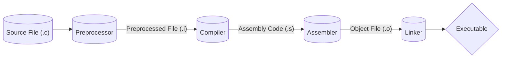

## Introduction

C is an imperative procedural language, with structural programming.  This basically means you need to explicitly state what you are trying to do. These are a part of why C, besides the fact that it is strict syntactically, is much faster.  C is what is known as a [[low-level programming language]], unlike [[Python]] which is [[high-level programming language]].

Here you can find a diagram that illustrates the process of turning a .c source file to an executable.

---
## Video(s)

<iframe width="560" height="315" src="https://www.youtube.com/embed/de2Hsvxaf8M?si=SWYtyQcTkD-TPX9F" title="YouTube video player" frameborder="0" allow="accelerometer; autoplay; clipboard-write; encrypted-media; gyroscope; picture-in-picture; web-share" allowfullscreen></iframe>

---

<iframe width="560" height="315" src="https://www.youtube.com/embed/2ybLD6_2gKM?si=bzqeRle-xQ5kx7t0" title="YouTube video player" frameborder="0" allow="accelerometer; autoplay; clipboard-write; encrypted-media; gyroscope; picture-in-picture; web-share" allowfullscreen></iframe>

---
## Resources
1. [C (programming language) - Wikipedia](https://en.wikipedia.org/wiki/C_(programming_language))
