---
My name is Gourav Pullela and I am currently an undergraduate studying computer engineering.  Feel free to explore my digital garden!

<a target="_blank" href="./assets/Resume/Gourav-Pullela-Resume.pdf">Resume</a> | [GitHub](https://github.com/gpullela) | [Linkedin](https://www.linkedin.com/in/gourav-pullela/)

## Check out my projects!  
---
- [[IUBSAT]]
- [[CGOL-3D |Conway's Game of Life in 3D]]
- [[HPC-in-RSA|HPC in RSA]]
- [[misc |Others]]

## the rabbit hole
---

>"*We're all mad here.*"
\- Cheshire Cat, *Alice in Wonderland*

```mermaid
graph TB;
A["🕳️🐇"] --> low["Low-level programming language"] & high(high-level programming language) & hw(hardware description language);
low --> asm(Assembly language) & c(c);
c --> omp(OpenMP) --> cpu(CPU);
asm --> isa(instruction set architecture) --> cpu;
high --> py(Python) --> jax(JAX) & ml(Machine Learning);
ml --> jax --> cpu & gpu(GPU) & tpu(TPU);
cpu & gpu & tpu --> hpc(HPC);
hw --> v(Verilog) & sv(System Verilog) --> fpga(FPGA);
class high,hw,asm,c,omp,cpu,isa,py,jax,ml,gpu,tpu,hpc,v,sv,fpga internal-links;
click low href "./Engineering/low-level-programming-language";
```

## Watch of the Week 📽️
---
<iframe width="560" height="315" src="https://www.youtube.com/embed/QQ2QOPWZKVc?si=UcXjKbEb8rC90HqQ" title="YouTube video player" frameborder="0" allow="accelerometer; autoplay; clipboard-write; encrypted-media; gyroscope; picture-in-picture; web-share" allowfullscreen></iframe>

## Learn more about my digital garden
---
You will find that many of the projects have linked notes - that is the beauty of a digital garden (and using Markdown files)!  My notes are written using [Obsidian.md](https://obsidian.md/) and built using [jackyzha0/quartz](https://quartz.jzhao.xyz/), which allows me to display this amazing vault as a website statically using [GitHub Pages](https://pages.github.com/) using a single Github Workflow.  

